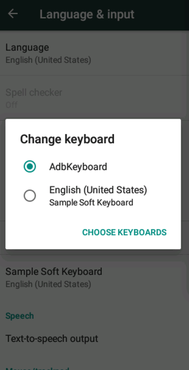

# ContextMig

This repository contains the source code and dataset of Android test case migration tool ContextMig.

## How to use ContextMig
1. Prerequisites
   - A Pixel 3 emulator with API 23 with target app installed
   - OpenAI API Key
   - Python 3.8

2. Usage
   - Install the required packages: `pip install -r requirements.txt`.
   - Populate the `code/config.py` file with the information of device name and gpt api key.
   - Run the `code/main.py` file. 
     - The `ATX` app will be automatically installed on the emulator, which is a communication app for the Uiautomator2 framework.
     - Set the keyboard of the emulator to `AdbKeyboard` after installing `ATX` app. 
   - You can view the operation logs of the ContextMig that contains four agents (test semantic analyzer, event contextual semantic analyzer, event selector, test script generator) in the console or in the `log/run.log` file.
   - After the migration is complete, you will find a markdown file summarizing the workflow of this migration in the folder `dataset/result/`.
   